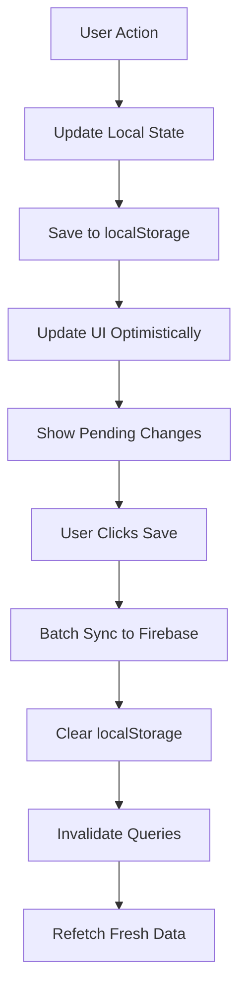
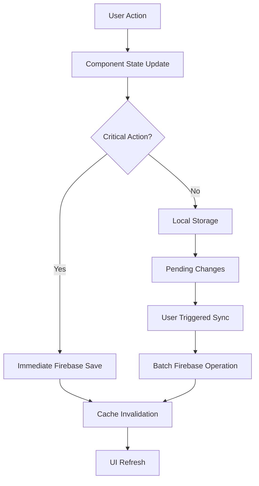
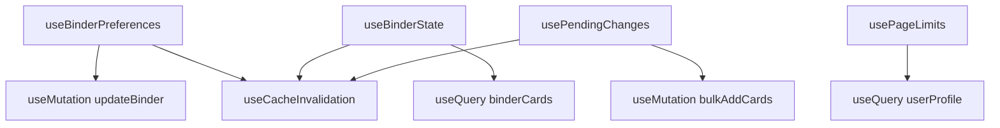

# Binder Functionality Documentation

## 🎯 Overview

This document provides a comprehensive overview of the Pokemon Binder functionality in the application, including data structures, component architecture, data saving strategies, and implementation details. This documentation will help streamline the implementation of data saving features.

---

## 📋 Table of Contents

1. [Binder Data Structure](#binder-data-structure)
2. [Core Components](#core-components)
3. [Data Management Strategy](#data-management-strategy)
4. [Adding Cards to Binders](#adding-cards-to-binders)
5. [Binder Settings & Preferences](#binder-settings--preferences)
6. [Data Saving Implementation](#data-saving-implementation)
7. [Technical Architecture](#technical-architecture)
8. [File Structure Overview](#file-structure-overview)

---

## 🗂️ Binder Data Structure

### Binder Document (Firebase)

```javascript
// users/{userId}/binders/{binderId}
{
  id: "binder_123",
  ownerId: "user_456",
  binderName: "Base Set Collection",
  description: "My complete Base Set collection", // Optional
  pageCount: 10,
  gridSize: "3x3", // "3x3", "4x3", "4x4"
  showReverseHolos: false,
  hideMissingCards: false,
  missingCards: [1, 5, 12], // Array of card numbers
  sortBy: "slot", // "slot", "name", "number", "rarity"
  sortDirection: "asc", // "asc", "desc"
  orderedPageOriginalNumbers: [1, 2, 3, 4, 5], // For drag-and-drop reordering
  totalCardsInBinder: 45,
  visibility: "private", // "private", "public", "unlisted"
  createdAt: Timestamp,
  updatedAt: Timestamp
}
```

### Card Document (Firebase Subcollection)

```javascript
// users/{userId}/binders/{binderId}/cards/{cardEntryId}
{
  id: "card_entry_789",
  cardApiId: "base1-4", // Pokemon TCG API ID
  pageNumber: 1, // Actual page number (not spread number)
  slotInPage: 5, // Slot position within the page
  name: "Charizard",
  set: "Base Set",
  setId: "base1",
  number: "4",
  rarity: "Rare Holo",
  images: {
    small: "https://...",
    large: "https://..."
  },
  tcgplayer: { ... }, // TCGPlayer pricing data
  artist: "Mitsuhiro Arita",
  cardmarket: { ... }, // Cardmarket pricing data
  addedAt: Timestamp,
  order: Number // For custom ordering
}
```

---

## 🔧 Core Components

### 1. Main Binder Page

**File**: `src/pages/Binder.jsx`

The central component that orchestrates the entire binder experience:

```javascript
const Binder = () => {
  // Key hooks and state management
  const { preferences, updatePreferences, savePreferences, isDirty } =
    useBinderPreferences(binderId);
  const binderState = useBinderState(binderId, preferences, currentPage);
  const { canAdd, isAtLimit, limitReason } = usePageLimits(
    preferences?.pageCount || 0
  );

  // Local UI state
  const [currentPage, setCurrentPage] = useState(1);
  const [isOverviewModeActive, setIsOverviewModeActive] = useState(false);
  const [isAddCardsModalOpen, setIsAddCardsModalOpen] = useState(false);

  // Event handlers for binder operations
  const handleAddCards = () => setIsAddCardsModalOpen(true);
  const handleCardsAdded = (cards) => {
    /* Add cards logic */
  };
  const handlePageReorder = ({ oldIndex, newIndex }) => {
    /* Reorder pages */
  };
};
```

**Key Features:**

- Binder preferences management
- Page navigation and limits
- Card addition workflow
- Page reordering (drag & drop)
- Overview mode toggle
- Auto-save with dirty state tracking

### 2. Binder Spread Component

**File**: `src/components/binder/BinderSpread.jsx`

Displays the two-page spread view mimicking a real binder:

```javascript
const BinderSpread = ({
  gridDimensions,
  gridSize,
  currentPage,
  totalPages,
  cardsOnPage1,
  cardsOnPage2,
  onAddCard,
  onPreviousPage,
  onNextPage,
  onAddPage,
  onDeletePage,
}) => {
  // Page layout calculation
  const getPageLayout = (page) => {
    if (page === 1) {
      // Page 1: Empty cover (left) + Page 1 content (right)
      return {
        showCoverPage: true,
        leftSide: { type: "cover", isEmpty: true, pageNumber: 0 },
        rightSide: { type: "content", isEmpty: false, pageNumber: 1 },
      };
    } else {
      // Page 2+: Normal spreads with content on both sides
      const leftPageNumber = (page - 2) * 2 + 2;
      const rightPageNumber = leftPageNumber + 1;
      return {
        showCoverPage: false,
        leftSide: { type: "content", pageNumber: leftPageNumber },
        rightSide: { type: "content", pageNumber: rightPageNumber },
      };
    }
  };
};
```

### 3. Add Cards Modal

**File**: `src/components/cards/AddCardsModal.jsx`

Modal for discovering and adding cards to binders:

```javascript
const AddCardsModal = ({ isOpen, onClose, binderId, onCardsAddedLocally }) => {
  const [activeTab, setActiveTab] = useState("search"); // "search" or "sets"
  const [selectedCards, setSelectedCards] = useState([]);

  const handleAddSelectedCards = async () => {
    // Add cards to local storage first
    const result = addCardsToPending(binderId, selectedCards);
    if (result.success) {
      onCardsAddedLocally({
        addedCount: result.addedCount,
        duplicatesSkipped: result.duplicatesSkipped,
      });
    }
  };
};
```

**Features:**

- Card search tab with Pokemon TCG API integration
- Set browse tab for exploring complete sets
- Multi-card selection
- Local storage for pending changes
- Duplicate detection

### 4. Binder Grid Component

**File**: `src/components/binder/BinderGrid.jsx`

Renders the grid of card slots for a single page:

```javascript
const BinderGrid = ({
  gridDimensions,
  rows,
  cols,
  onAddCard,
  getSavedCardForSlot,
  ...props
}) => {
  const gridSlots = Array.from({ length: rows * cols }, (_, i) => i + 1);

  return (
    <div
      className="grid"
      style={{
        gridTemplateColumns: `repeat(${cols}, 1fr)`,
        gridTemplateRows: `repeat(${rows}, 1fr)`,
        width: `${gridDimensions.gridWidth}px`,
        height: `${gridDimensions.gridHeight}px`,
      }}
    >
      {gridSlots.map((slot) => (
        <BinderCardSlot
          key={slot}
          slot={slot}
          onAddCard={onAddCard}
          savedCard={getSavedCardForSlot(slot)}
        />
      ))}
    </div>
  );
};
```

### 5. Pending Changes Button

**File**: `src/components/binder/PendingChangesButton.jsx`

Manages local pending changes and Firebase synchronization:

```javascript
const PendingChangesButton = ({ binderId }) => {
  const { summary, hasChanges, isSyncing, syncToFirebase } =
    usePendingChanges(binderId);

  const handleSync = async () => {
    const result = await syncToFirebase();
    // Show feedback to user
  };

  // Display pending changes count and sync button
  return hasChanges ? (
    <div>
      <div>Pending Changes: {summary.totalChanges}</div>
      <Button onClick={handleSync} disabled={isSyncing}>
        Save Changes
      </Button>
    </div>
  ) : null;
};
```

---

## 💾 Data Management Strategy

### Local Storage Strategy

The application uses a hybrid approach for data management:

1. **Immediate Local Storage**: Changes are saved to `localStorage` immediately
2. **Batch Firebase Sync**: Multiple changes are batched and synced to Firebase
3. **Optimistic Updates**: UI updates immediately while Firebase sync happens in background

### Local Storage Structure

```javascript
// Key: `pokemon_binder_pending_${binderId}`
{
  version: "1.0",
  binderId: "binder_123",
  lastModified: "2024-01-15T10:30:00Z",
  addedCards: [
    {
      tempId: "temp_1705320600_abc123",
      pokemonCardId: "base1-4",
      cardData: {
        name: "Charizard",
        set: "Base Set",
        number: "4",
        rarity: "Rare Holo",
        images: { ... }
      },
      addedAt: "2024-01-15T10:30:00Z",
      status: "pending"
    }
  ],
  removedCardIds: ["card_entry_456"],
  updatedCards: [
    {
      cardEntryId: "card_entry_789",
      updates: { pageNumber: 2, slotInPage: 3 }
    }
  ]
}
```

### Data Flow



---

## 🃏 Adding Cards to Binders

### Card Addition Workflow

1. **Open Add Cards Modal** (`AddCardsModal.jsx`)
2. **Search/Browse Cards** (Pokemon TCG API integration)
3. **Select Multiple Cards** (Multi-selection with state management)
4. **Add to Pending** (`addCardsToPending()` utility)
5. **Show Pending Changes** (`PendingChangesButton.jsx`)
6. **Bulk Sync to Firebase** (`bulkAddCardsToBinder()` service)

### Implementation Details

#### Step 1: Card Search Integration

```javascript
// src/components/cards/CardSearchTab.jsx
const CardSearchTab = ({ selectedCards, onCardToggle }) => {
  const [searchQuery, setSearchQuery] = useState("");
  const { data, fetchNextPage, hasNextPage } = useInfiniteQuery({
    queryKey: ["pokemon-cards", searchQuery],
    queryFn: ({ pageParam = 1 }) => searchPokemonCards(searchQuery, pageParam),
  });
};
```

#### Step 2: Local Storage Management

```javascript
// src/utils/localBinderStorage.js
export const addCardsToPending = (binderId, cards) => {
  const existing = getPendingChanges(binderId) || { addedCards: [] };

  const cardsToAdd = cards.map((card) => ({
    tempId: `temp_${Date.now()}_${Math.random().toString(36).substr(2, 9)}`,
    pokemonCardId: card.id,
    cardData: {
      name: card.name,
      set: card.set?.name || "",
      setId: card.set?.id || "",
      number: card.number || "",
      rarity: card.rarity || "",
      images: card.images || {},
    },
    addedAt: new Date().toISOString(),
    status: "pending",
  }));

  const updated = {
    ...existing,
    addedCards: [...existing.addedCards, ...cardsToAdd],
  };

  savePendingChanges(binderId, updated);

  return {
    success: true,
    addedCount: cardsToAdd.length,
  };
};
```

#### Step 3: Firebase Bulk Sync

```javascript
// src/services/firestore.js
export const bulkAddCardsToBinder = async (userId, binderId, cardsData) => {
  try {
    const batch = writeBatch(db);
    const addedCards = [];

    // Get next available slots
    const { nextSlots } = await getNextAvailableSlots(
      userId,
      binderId,
      cardsData.length
    );

    cardsData.forEach((cardData, index) => {
      const cardRef = doc(
        collection(db, "users", userId, "binders", binderId, "cards")
      );
      const slot = nextSlots[index];

      const cardDocument = {
        cardApiId: cardData.cardApiId,
        pageNumber: slot.pageNumber,
        slotInPage: slot.slotInPage,
        name: cardData.name,
        set: cardData.set,
        setId: cardData.setId,
        number: cardData.number,
        rarity: cardData.rarity,
        images: cardData.images,
        addedAt: serverTimestamp(),
      };

      batch.set(cardRef, cardDocument);
      addedCards.push({ id: cardRef.id, ...cardDocument });
    });

    // Update binder metadata
    const binderRef = doc(db, "users", userId, "binders", binderId);
    batch.update(binderRef, {
      totalCardsInBinder: increment(cardsData.length),
      updatedAt: serverTimestamp(),
    });

    await batch.commit();

    return {
      success: true,
      addedCount: addedCards.length,
      cards: addedCards,
    };
  } catch (error) {
    return { success: false, error: error.message };
  }
};
```

---

## ⚙️ Binder Settings & Preferences

### Preferences Management

**File**: `src/hooks/useBinderPreferences.js`

```javascript
export const useBinderPreferences = (binderId) => {
  const [localPreferences, setLocalPreferences] = useState(defaultPreferences);
  const [isDirty, setIsDirty] = useState(false);

  // Fetch binder document
  const { data: binderDocument, isLoading } = useQuery({
    queryKey: ["binder", binderId, currentUser?.uid],
    queryFn: () => getBinder(currentUser.uid, binderId),
  });

  // Update mutation with optimistic updates
  const updateBinderMutation = useMutation({
    mutationFn: (variables) =>
      updateBinder(variables.userId, variables.binderId, variables.preferences),
    onMutate: async (variables) => {
      // Optimistically update cache
      optimisticallyUpdateInList(
        ["userBinders", variables.userId, {}],
        variables.binderId,
        variables.preferences
      );
    },
    onSuccess: () => {
      setIsDirty(false);
      invalidateAllBinderData(currentUser.uid, binderId);
    },
  });

  const updatePreferences = useCallback(
    (updates) => {
      setLocalPreferences((prev) => {
        const newPrefs = { ...prev, ...updates };
        setIsDirty(
          JSON.stringify(newPrefs) !== JSON.stringify(savedPreferences)
        );
        return newPrefs;
      });
    },
    [savedPreferences]
  );

  return {
    preferences: localPreferences,
    isDirty,
    updatePreferences,
    savePreferences: () =>
      updateBinderMutation.mutateAsync({
        userId: currentUser.uid,
        binderId,
        preferences: localPreferences,
      }),
    revertPreferences: () => {
      setLocalPreferences(savedPreferences);
      setIsDirty(false);
    },
  };
};
```

### Available Preferences

```javascript
const binderPreferences = {
  binderName: "My Collection", // Binder title
  pageCount: 10, // Number of pages
  gridSize: "3x3", // Grid layout ("3x3", "4x3", "4x4")
  showReverseHolos: false, // Display reverse holo variants
  hideMissingCards: false, // Hide missing card slots
  missingCards: [1, 5, 12], // Array of missing card numbers
  sortBy: "slot", // Sort method
  sortDirection: "asc", // Sort direction
  orderedPageOriginalNumbers: [1, 2, 3, 4], // Custom page order
};
```

### Settings Components

- **Grid Size Selector**: Choose between 3x3, 4x3, 4x4 layouts
- **Page Management**: Add/remove pages with limit validation
- **Missing Cards**: Track and manage missing cards
- **Sorting Options**: Various sorting methods for cards
- **Visual Options**: Toggle reverse holos, hide missing cards

---

## 💾 Data Saving Implementation

### Current Implementation Strategy

#### 1. Immediate Local Storage

```javascript
// When user adds cards from modal
const handleAddSelectedCards = async () => {
  // Immediately save to localStorage
  const result = addCardsToPending(binderId, selectedCards);

  if (result.success) {
    // Update UI optimistically
    setSelectedCards([]);
    onCardsAddedLocally(result);
    onClose();
  }
};
```

#### 2. Pending Changes System

```javascript
// src/hooks/usePendingChanges.js
export const usePendingChanges = (binderId) => {
  const [isSyncing, setIsSyncing] = useState(false);

  const syncToFirebase = useCallback(async () => {
    setIsSyncing(true);

    try {
      // Handle card additions using bulk operation
      if (pendingData.addedCards?.length > 0) {
        const cardsToAdd = transformPendingCardsForFirebase(
          pendingData.addedCards
        );
        const result = await bulkAddCardsToBinder(
          currentUser.uid,
          binderId,
          cardsToAdd
        );

        if (!result.success) {
          throw new Error(result.error);
        }
      }

      // Invalidate cache and refresh UI
      await queryClient.invalidateQueries({
        queryKey: ["binderCards", binderId],
      });

      // Clear pending changes
      clearPendingChanges(binderId);

      return {
        success: true,
        message: `Successfully synced ${summary.totalChanges} changes`,
      };
    } catch (error) {
      return { success: false, error: error.message };
    } finally {
      setIsSyncing(false);
    }
  }, [pendingData, currentUser.uid, binderId]);

  return {
    hasChanges: hasPendingChanges(binderId),
    summary: getPendingChangesSummary(binderId),
    isSyncing,
    syncToFirebase,
  };
};
```

#### 3. Auto-Save vs Manual Save

Currently implemented as **Manual Save** with pending changes button:

```javascript
// In Sidebar.jsx
<PendingChangesButton binderId={binderId} />
```

**Advantages of Current Approach:**

- User control over when data is saved
- Batch operations reduce Firebase costs
- Better handling of network issues
- Clear indication of unsaved changes

### Recommended Improvements for Data Saving

#### 1. Auto-Save for Critical Actions

```javascript
// Implement auto-save for critical binder settings
const useAutoSavePreferences = (binderId) => {
  const { savePreferences, isDirty } = useBinderPreferences(binderId);

  useEffect(() => {
    if (isDirty) {
      const timeoutId = setTimeout(() => {
        savePreferences();
      }, 2000); // Auto-save after 2 seconds of inactivity

      return () => clearTimeout(timeoutId);
    }
  }, [isDirty, savePreferences]);
};
```

#### 2. Optimistic Updates with Rollback

```javascript
// Enhanced error handling with rollback capability
const syncWithRollback = async (pendingData, rollbackFn) => {
  try {
    const result = await bulkAddCardsToBinder(userId, binderId, pendingData);
    if (!result.success) {
      rollbackFn();
      throw new Error(result.error);
    }
    return result;
  } catch (error) {
    rollbackFn();
    throw error;
  }
};
```

#### 3. Progressive Sync Strategy

```javascript
// Sync smaller batches progressively
const progressiveSync = async (changes) => {
  const BATCH_SIZE = 10;
  const batches = chunkArray(changes, BATCH_SIZE);

  for (const batch of batches) {
    await syncBatch(batch);
    updateProgress((batches.indexOf(batch) + 1) / batches.length);
  }
};
```

---

## 🏗️ Technical Architecture

### State Management Flow



### Hook Dependencies



### Component Hierarchy

```
Binder.jsx (Main Container)
├── WorkspaceLayout.jsx
│   ├── Sidebar.jsx
│   │   ├── BinderSettingsSection.jsx
│   │   ├── CollectionManagementSection.jsx
│   │   └── PendingChangesButton.jsx
│   └── BinderSpread.jsx
│       ├── BinderGrid.jsx
│       │   └── BinderCardSlot.jsx
│       └── BinderOverview.jsx
│           └── PageThumbnail.jsx
└── AddCardsModal.jsx
    ├── CardSearchTab.jsx
    │   └── CardGrid.jsx
    │       └── CardItem.jsx
    └── SetBrowseTab.jsx
```

---

## 📁 File Structure Overview

### Core Binder Files

```
src/
├── pages/
│   ├── Binder.jsx                          # Main binder page
│   ├── BinderListPage.jsx                  # List of user's binders
│   ├── BinderDashboard.jsx                 # Binder overview dashboard
│   └── FullBinder.jsx                      # Complete binder implementation
│
├── components/
│   ├── binder/
│   │   ├── BinderCard.jsx                  # Individual binder card in list
│   │   ├── BinderSpread.jsx                # Two-page spread view
│   │   ├── BinderGrid.jsx                  # Grid of card slots
│   │   ├── BinderCardSlot.jsx              # Individual card slot
│   │   ├── BinderOverview.jsx              # Thumbnail overview of pages
│   │   ├── PageThumbnail.jsx               # Individual page thumbnail
│   │   ├── PendingChangesButton.jsx        # Pending changes management
│   │   ├── BinderNavigation.jsx            # Page navigation controls
│   │   └── index.js                        # Component exports
│   │
│   ├── cards/
│   │   ├── AddCardsModal.jsx               # Modal for adding cards
│   │   ├── CardSearchTab.jsx               # Card search interface
│   │   ├── SetBrowseTab.jsx               # Set browsing interface
│   │   ├── CardGrid.jsx                    # Grid of cards in search
│   │   ├── CardItem.jsx                    # Individual card in search
│   │   └── index.js                        # Component exports
│   │
│   └── workspace/
│       ├── WorkspaceLayout.jsx             # Main workspace container
│       └── Sidebar.jsx                     # Binder settings sidebar
│
├── hooks/
│   ├── useBinderPreferences.js             # Binder settings management
│   ├── useBinderState.js                   # Binder data and cards
│   ├── usePendingChanges.js               # Local pending changes
│   ├── useUserLimits.js                   # User limit validation
│   ├── useGridDimensions.js               # Responsive grid calculations
│   └── index.js                           # Hook exports
│
├── services/
│   └── firestore.js                       # Firebase operations
│       ├── addBinder()                    # Create new binder
│       ├── getBinder()                    # Fetch binder data
│       ├── updateBinder()                 # Update binder settings
│       ├── deleteBinder()                 # Delete binder
│       ├── addCardToBinder()              # Add single card
│       ├── bulkAddCardsToBinder()         # Add multiple cards
│       ├── updateCardInBinder()           # Update card data
│       ├── removeCardFromBinder()         # Remove card
│       └── getCardsForPages()             # Fetch cards for pages
│
├── utils/
│   ├── localBinderStorage.js              # Local storage management
│   │   ├── addCardsToPending()            # Add cards to pending
│   │   ├── getPendingChanges()            # Get pending changes
│   │   ├── clearPendingChanges()          # Clear pending changes
│   │   └── hasPendingChanges()            # Check for changes
│   │
│   └── gridUtils.js                       # Grid calculation utilities
│
└── storage/
    └── adapters/
        └── firebaseAdapter.js              # Firebase storage adapter
```

### Key Relationships

1. **Binder.jsx** orchestrates the entire binder experience
2. **useBinderPreferences.js** manages binder settings with dirty state tracking
3. **useBinderState.js** handles card data and pagination
4. **AddCardsModal.jsx** provides card discovery and selection
5. **PendingChangesButton.jsx** manages local-to-cloud synchronization
6. **localBinderStorage.js** provides localStorage abstraction for pending changes
7. **firestore.js** contains all Firebase operations with validation

---

## 🎯 Next Steps for Data Saving Implementation

### 1. Enhanced Auto-Save (Priority: High)

- Implement debounced auto-save for critical settings
- Add auto-save toggle in user preferences
- Implement background sync with retry logic

### 2. Improved Error Handling (Priority: High)

- Add comprehensive error boundaries
- Implement retry mechanisms for failed syncs
- Add user-friendly error messages with recovery options

### 3. Offline Support (Priority: Medium)

- Detect network status
- Queue operations when offline
- Sync when connection restored

### 4. Advanced Pending Changes (Priority: Medium)

- Add undo/redo functionality
- Implement conflict resolution for simultaneous edits
- Add change history and diff viewing

### 5. Performance Optimizations (Priority: Low)

- Implement virtual scrolling for large binders
- Add image lazy loading and caching
- Optimize Firebase queries with pagination

---

## 📚 Additional Resources

- **Firebase Documentation**: [Firestore Best Practices](https://firebase.google.com/docs/firestore/best-practices)
- **TanStack Query**: [Optimistic Updates](https://tanstack.com/query/latest/docs/react/guides/optimistic-updates)
- **Local Storage**: [MDN Web Storage API](https://developer.mozilla.org/en-US/docs/Web/API/Web_Storage_API)
- **Pokemon TCG API**: [API Documentation](https://docs.pokemontcg.io/)

---

_This documentation was generated on {{ current_date }} and reflects the current state of the binder functionality implementation._
