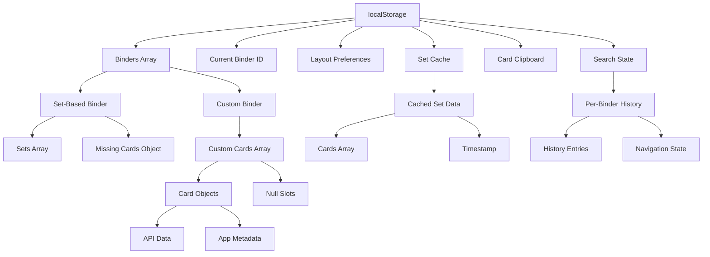

# Pokemon Binder - Card Storage & Management System

## Overview

This document provides an in-depth technical analysis of how the Pokemon Binder application handles card addition, storage, editing, and data management using localStorage. It covers the complete data flow, storage structures, and management operations.

## Table of Contents

1. [localStorage Data Architecture](#localstorage-data-architecture)
2. [Card Adding System](#card-adding-system)
3. [Card Storage Mechanics](#card-storage-mechanics)
4. [Card Editing Operations](#card-editing-operations)
5. [Data Structure Deep Dive](#data-structure-deep-dive)
6. [Storage Management](#storage-management)
7. [Error Handling & Recovery](#error-handling--recovery)

---

## localStorage Data Architecture

### Storage Key System

The application uses a structured approach to localStorage with specific keys for different data types:

```javascript
const STORAGE_KEYS = {
  BINDERS: "pkmnbinder_binders", // Main binder data
  CURRENT_BINDER: "pkmnbinder_current_binder", // Active binder ID
  LAYOUT_PREFS: "pkmnbinder_layout_prefs", // UI layout preferences
  SET_CACHE: "pkmnbinder_set_cache", // Pokemon TCG API cache
  CARD_CLIPBOARD: "pkmnbinder_card_clipboard", // Temporary card storage
  BINDER_HISTORY: "pkmnbinder_binder_history", // History tracking
};
```

### Data Hierarchy

```
localStorage
├── pkmnbinder_binders (Array of binder objects)
├── pkmnbinder_current_binder (String: binder ID)
├── pkmnbinder_layout_prefs (Object: UI preferences)
├── pkmnbinder_set_cache (Object: cached API data)
├── pkmnbinder_card_clipboard (Array: temporary cards)
└── pkmnbinder_binder_history_{binderId} (Array: per-binder history)
```

---

## Card Adding System

### 1. Card Search and Discovery

#### API Integration

```javascript
const searchCards = async (query, filters = {}) => {
  const searchParams = [];

  // Build query parameters
  if (query.trim()) {
    searchParams.push(`name:"${query.trim()}*"`);
  }

  if (filters.rarity) {
    searchParams.push(`rarity:"${filters.rarity}"`);
  }

  if (filters.type) {
    searchParams.push(`types:"${filters.type}"`);
  }

  if (filters.set) {
    searchParams.push(`set.id:"${filters.set}"`);
  }

  const queryString = searchParams.join(" ");

  try {
    const response = await fetch(
      `https://api.pokemontcg.io/v2/cards?q=${encodeURIComponent(
        queryString
      )}&pageSize=50&orderBy=name`
    );

    const data = await response.json();
    return data.data || [];
  } catch (error) {
    console.error("Search failed:", error);
    return [];
  }
};
```

#### Search State Persistence

The search modal maintains its state across sessions:

```javascript
const SEARCH_STATE_KEY = "pkmnbinder_card_search_state";

const saveSearchState = () => {
  const stateToSave = {
    searchQuery,
    searchResults,
    selectedFilters: {
      rarity: selectedFilters.rarity,
      type: selectedFilters.type,
      set: selectedFilters.set,
    },
    scrollPosition,
  };

  try {
    localStorage.setItem(SEARCH_STATE_KEY, JSON.stringify(stateToSave));
  } catch (error) {
    console.error("Failed to save search state:", error);
  }
};
```

### 2. Card Addition Process

#### Step-by-Step Addition Flow

```javascript
const handleAddCard = (card, position = null) => {
  // 1. Determine target position
  let targetPosition =
    targetCardPosition !== null ? targetCardPosition : position;

  // 2. Calculate position if not specified
  if (targetPosition === null) {
    const cardsPerPage = layout.cards;
    let startIndex, endIndex;

    if (currentPage === 0) {
      // Right page only (page 0)
      startIndex = 0;
      endIndex = cardsPerPage - 1;
    } else {
      // Calculate for left and right pages
      const leftPhysicalPage = 2 * currentPage - 1;
      const rightPhysicalPage = 2 * currentPage;

      startIndex = leftPhysicalPage * cardsPerPage;
      endIndex = (rightPhysicalPage + 1) * cardsPerPage - 1;
    }

    // Find first empty spot in current page range
    const currentCards = getCustomCards(currentBinder.id);
    for (let i = startIndex; i <= endIndex; i++) {
      if (!currentCards[i]) {
        targetPosition = i;
        break;
      }
    }

    // If no empty spot on current page, find first empty spot globally
    if (targetPosition === null) {
      const emptyIndex = currentCards.findIndex((card) => card === null);
      targetPosition = emptyIndex >= 0 ? emptyIndex : currentCards.length;
    }
  }

  // 3. Add card to storage
  const addedCard = addCustomCard(currentBinder.id, card, targetPosition);

  // 4. Update history
  if (addedCard) {
    updateHistoryWithFinalState(currentBinder.id);

    // 5. Refresh UI state
    const updatedCards = getCustomCards(currentBinder.id);
    setCustomCards(updatedCards);
    setCards(updatedCards);

    // 6. Update binder state
    const updatedBinder = { ...currentBinder, customCards: updatedCards };
    setCurrentBinder(updatedBinder);
    setBinders(getBinders());

    // 7. Clear target position
    setTargetCardPosition(null);

    return true;
  }

  return false;
};
```

#### Card Object Enhancement

When adding a card, additional metadata is attached:

```javascript
const addCustomCard = (binderId, card, position = null) => {
  const binders = getBinders();
  const binderIndex = binders.findIndex((b) => b.id === binderId);

  if (binderIndex >= 0) {
    const binder = binders[binderIndex];
    if (!binder.customCards) {
      binder.customCards = [];
    }

    // Create enhanced card object
    const cardWithPosition = {
      ...card, // Original card data from API
      positionId: `${Date.now()}_${Math.random()}`, // Unique position identifier
      addedAt: new Date().toISOString(), // Addition timestamp
      isReverseHolo: card.isReverseHolo || false, // Reverse holo flag
    };

    // Position determination and insertion logic
    let finalPosition = position;
    if (position === null || position < 0) {
      const emptyIndex = binder.customCards.findIndex((card) => card === null);
      finalPosition = emptyIndex >= 0 ? emptyIndex : binder.customCards.length;
    }

    // Add history entry before making changes
    addHistoryEntry(binderId, "add", {
      cardName: card.name,
      cardImage: card.images?.small,
      position: finalPosition,
    });

    // Insert card at position
    if (position !== null && position >= 0) {
      // Extend array if necessary
      while (binder.customCards.length <= position) {
        binder.customCards.push(null);
      }
      binder.customCards[position] = cardWithPosition;
    } else {
      // Find first empty slot or add to end
      const emptyIndex = binder.customCards.findIndex((card) => card === null);
      if (emptyIndex >= 0) {
        binder.customCards[emptyIndex] = cardWithPosition;
      } else {
        binder.customCards.push(cardWithPosition);
      }
    }

    // Update binder metadata
    binder.updatedAt = new Date().toISOString();

    // Save to localStorage
    localStorage.setItem(STORAGE_KEYS.BINDERS, JSON.stringify(binders));

    return cardWithPosition;
  }

  return null;
};
```

---

## Card Storage Mechanics

### 1. Binder Data Structure

#### Complete Binder Object

```javascript
const binderStructure = {
  id: "binder_1703123456789",              // Unique identifier
  name: "My Custom Collection",            // User-defined name
  binderType: "custom",                    // "set" or "custom"
  sets: [],                               // For set-based binders
  missingCards: {},                       // For set-based binders
  customCards: [                          // For custom binders
    {
      // Pokemon TCG API data
      id: "base1-1",
      name: "Alakazam",
      supertype: "Pokémon",
      subtypes: ["Stage 2"],
      hp: "80",
      types: ["Psychic"],
      attacks: [...],
      weaknesses: [...],
      retreatCost: ["Colorless", "Colorless", "Colorless"],
      convertedRetreatCost: 3,
      set: {
        id: "base1",
        name: "Base",
        series: "Base",
        printedTotal: 102,
        total: 102,
        legalities: {...},
        ptcgoCode: "BAS",
        releaseDate: "1999/01/09",
        updatedAt: "2020/08/14 09:35:00",
        images: {...}
      },
      number: "1",
      artist: "Ken Sugimori",
      rarity: "Rare Holo",
      nationalPokedexNumbers: [65],
      legalities: {...},
      images: {
        small: "https://images.pokemontcg.io/base1/1.png",
        large: "https://images.pokemontcg.io/base1/1_hires.png"
      },
      tcgplayer: {...},
      cardmarket: {...},

      // Application-specific metadata
      positionId: "1703123456789_0.123456789", // Unique position ID
      addedAt: "2023-12-21T10:30:45.123Z",     // Addition timestamp
      isReverseHolo: false,                     // Variant flag
    },
    null,                                   // Empty slot
    {
      // Another card...
    }
  ],
  createdAt: "2023-12-21T10:00:00.000Z",   // Binder creation time
  updatedAt: "2023-12-21T10:30:45.123Z",   // Last modification time
};
```

### 2. Storage Optimization

#### Null Slot Management

Empty positions are stored as `null` to maintain exact positioning:

```javascript
// Example customCards array
const customCards = [
  {
    /* card data */
  }, // Position 0: Card present
  null, // Position 1: Empty slot
  {
    /* card data */
  }, // Position 2: Card present
  null, // Position 3: Empty slot
  null, // Position 4: Empty slot
  {
    /* card data */
  }, // Position 5: Card present
];
```

#### Position ID System

Each card gets a unique position identifier for tracking:

```javascript
const generatePositionId = () => {
  return `${Date.now()}_${Math.random()}`;
};

// Example: "1703123456789_0.8234567891234567"
```

### 3. Cache Management

#### Set Data Caching

```javascript
const saveSetToCache = (setId, cards) => {
  const cache = JSON.parse(
    localStorage.getItem(STORAGE_KEYS.SET_CACHE) || "{}"
  );

  cache[setId] = {
    cards,
    timestamp: Date.now(),
  };

  localStorage.setItem(STORAGE_KEYS.SET_CACHE, JSON.stringify(cache));
};

const getSetFromCache = (setId) => {
  const cache = JSON.parse(
    localStorage.getItem(STORAGE_KEYS.SET_CACHE) || "{}"
  );
  const cachedData = cache[setId];

  if (!cachedData) return null;

  // Check expiry (24 hours)
  const CACHE_EXPIRY = 24 * 60 * 60 * 1000;
  if (Date.now() - cachedData.timestamp > CACHE_EXPIRY) {
    delete cache[setId];
    localStorage.setItem(STORAGE_KEYS.SET_CACHE, JSON.stringify(cache));
    return null;
  }

  return cachedData.cards;
};
```

---

## Card Editing Operations

### 1. Card Removal

#### Safe Removal Process

```javascript
const removeCustomCard = (binderId, cardIndex) => {
  const binders = getBinders();
  const binderIndex = binders.findIndex((b) => b.id === binderId);

  if (binderIndex >= 0) {
    const binder = binders[binderIndex];

    if (binder.customCards && cardIndex < binder.customCards.length) {
      const cardToRemove = binder.customCards[cardIndex];

      // Add history entry before removal
      if (cardToRemove) {
        addHistoryEntry(binderId, "remove", {
          cardName: cardToRemove.name,
          cardImage: cardToRemove.images?.small,
          position: cardIndex,
        });
      }

      // Set position to null (maintain array structure)
      binder.customCards[cardIndex] = null;
      binder.updatedAt = new Date().toISOString();

      localStorage.setItem(STORAGE_KEYS.BINDERS, JSON.stringify(binders));
      return true;
    }
  }

  return false;
};
```

### 2. Card Reordering

#### Drag & Drop Implementation

```javascript
const reorderCustomCards = (binderId, fromIndex, toIndex, isSwap = false) => {
  const binders = getBinders();
  const binderIndex = binders.findIndex((b) => b.id === binderId);

  if (binderIndex >= 0) {
    const binder = binders[binderIndex];

    if (!binder.customCards) {
      binder.customCards = [];
    }

    // Extend arrays if necessary
    const maxIndex = Math.max(fromIndex, toIndex);
    while (binder.customCards.length <= maxIndex) {
      binder.customCards.push(null);
    }

    const cardToMove = binder.customCards[fromIndex];
    const targetCard = binder.customCards[toIndex];

    // Record action for history
    addHistoryEntry(binderId, isSwap ? "swap" : "move", {
      cardName: cardToMove?.name || "Empty",
      fromPosition: fromIndex,
      toPosition: toIndex,
      isSwap,
    });

    if (isSwap) {
      // Swap positions
      binder.customCards[fromIndex] = targetCard;
      binder.customCards[toIndex] = cardToMove;
    } else {
      // Move card (shift positions)
      binder.customCards[fromIndex] = null;
      binder.customCards[toIndex] = cardToMove;
    }

    binder.updatedAt = new Date().toISOString();
    localStorage.setItem(STORAGE_KEYS.BINDERS, JSON.stringify(binders));

    return true;
  }

  return false;
};
```

### 3. Missing Card Status Toggle

#### Set-Based Binder Card Management

```javascript
const toggleCardStatus = (setId, cardNumber, isReverseHolo = false) => {
  const cardKey = isReverseHolo ? `${cardNumber}_reverse` : cardNumber;
  const currentBinder = getCurrentBinder();

  if (!currentBinder.missingCards[setId]) {
    currentBinder.missingCards[setId] = [];
  }

  const missingCards = currentBinder.missingCards[setId];
  const cardIndex = missingCards.indexOf(cardKey);

  if (cardIndex >= 0) {
    // Remove from missing (mark as collected)
    missingCards.splice(cardIndex, 1);
  } else {
    // Add to missing
    missingCards.push(cardKey);
  }

  // Update binder
  saveBinder(currentBinder);

  return cardIndex < 0; // Return true if card was added to missing
};
```

---

## Data Structure Deep Dive

### 1. Complete Storage Schema

```javascript
const storageSchema = {
  // Main binder storage
  "pkmnbinder_binders": [
    {
      id: "string",                    // Unique binder identifier
      name: "string",                  // User-defined name
      binderType: "set" | "custom",    // Binder type
      sets: [                          // For set-based binders
        {
          id: "string",
          name: "string",
          series: "string",
          printedTotal: "number",
          total: "number",
          // ... other set data
        }
      ],
      missingCards: {                  // For set-based binders
        "setId": ["cardNumber", "cardNumber_reverse", ...]
      },
      customCards: [                   // For custom binders
        {
          // Pokemon TCG API card data
          id: "string",
          name: "string",
          supertype: "string",
          subtypes: ["string"],
          hp: "string",
          types: ["string"],
          attacks: [/* attack objects */],
          weaknesses: [/* weakness objects */],
          resistances: [/* resistance objects */],
          retreatCost: ["string"],
          convertedRetreatCost: "number",
          set: {/* set object */},
          number: "string",
          artist: "string",
          rarity: "string",
          nationalPokedexNumbers: ["number"],
          legalities: {/* legality object */},
          images: {
            small: "string (URL)",
            large: "string (URL)"
          },
          tcgplayer: {/* pricing object */},
          cardmarket: {/* pricing object */},

          // Application metadata
          positionId: "string",        // Unique position identifier
          addedAt: "string (ISO)",     // Addition timestamp
          isReverseHolo: "boolean",    // Variant flag
        },
        null,                          // Empty slot
        // ... more cards or nulls
      ],
      createdAt: "string (ISO)",       // Creation timestamp
      updatedAt: "string (ISO)",       // Last update timestamp
    }
    // ... more binders
  ],

  // Current active binder
  "pkmnbinder_current_binder": "string (binder ID)",

  // UI preferences
  "pkmnbinder_layout_prefs": {
    id: "string",                      // Layout ID (2x2, 3x3, 4x3, 4x4)
    label: "string",                   // Display name
    cards: "number",                   // Cards per page
  },

  // API response cache
  "pkmnbinder_set_cache": {
    "setId": {
      cards: [/* array of card objects */],
      timestamp: "number",             // Cache timestamp
    }
    // ... more cached sets
  },

  // Temporary card storage
  "pkmnbinder_card_clipboard": [
    {
      // Same structure as customCards
      // Plus:
      clipboardAddedAt: "string (ISO)", // Clipboard timestamp
    }
    // ... up to 5 cards
  ],

  // Search state persistence
  "pkmnbinder_card_search_state": {
    searchQuery: "string",
    searchResults: [/* card objects */],
    selectedFilters: {
      rarity: "string",
      type: "string",
      set: "string",
    },
    scrollPosition: "number",
  },

  // Per-binder history (separate keys)
  "pkmnbinder_binder_history_{binderId}": [
    {
      id: "string",                    // Unique history entry ID
      timestamp: "string (ISO)",       // Action timestamp
      action: "add" | "remove" | "move" | "swap", // Action type
      cardName: "string",              // Card name for display
      cardImage: "string (URL)",       // Card image for display
      position: "number",              // Target position
      fromPosition: "number",          // For move/swap actions
      toPosition: "number",            // For move/swap actions
      isSwap: "boolean",               // For swap vs move
      binderState: [/* card array */], // State before action
      finalState: [/* card array */],  // State after action
    }
    // ... up to 20 entries per binder
  ],

  // History navigation state
  "pkmnbinder_binder_history_{binderId}_position": "number (-1 for current)",
  "pkmnbinder_binder_history_{binderId}_current": [/* current state snapshot */],
};
```

### 2. Data Relationships



---

## Storage Management

### 1. Initialization

```javascript
const initializeStorage = () => {
  const binders = localStorage.getItem(STORAGE_KEYS.BINDERS);

  if (!binders) {
    // Create default binder
    const defaultBinder = {
      id: "default",
      name: "My Collection",
      sets: [],
      missingCards: {},
      customCards: [],
      binderType: "set",
      createdAt: new Date().toISOString(),
      updatedAt: new Date().toISOString(),
    };

    localStorage.setItem(STORAGE_KEYS.BINDERS, JSON.stringify([defaultBinder]));
    localStorage.setItem(STORAGE_KEYS.CURRENT_BINDER, defaultBinder.id);
  }
};
```

### 2. CRUD Operations

#### Create Binder

```javascript
const createBinder = (name, binderType = "set") => {
  const newBinder = {
    id: `binder_${Date.now()}`,
    name: name,
    sets: [],
    missingCards: {},
    customCards: [],
    binderType: binderType,
    createdAt: new Date().toISOString(),
    updatedAt: new Date().toISOString(),
  };

  const binders = getBinders();
  binders.push(newBinder);
  localStorage.setItem(STORAGE_KEYS.BINDERS, JSON.stringify(binders));

  return newBinder;
};
```

#### Read Binders

```javascript
const getBinders = () => {
  const binders = localStorage.getItem(STORAGE_KEYS.BINDERS);
  return binders ? JSON.parse(binders) : [];
};

const getCurrentBinder = () => {
  const binderId = localStorage.getItem(STORAGE_KEYS.CURRENT_BINDER);
  const binders = getBinders();
  return binders.find((b) => b.id === binderId) || binders[0];
};
```

#### Update Binder

```javascript
const saveBinder = (binderData) => {
  const binders = getBinders();
  const binderIndex = binders.findIndex((b) => b.id === binderData.id);

  binderData.updatedAt = new Date().toISOString();

  if (binderIndex >= 0) {
    binders[binderIndex] = binderData;
  } else {
    binders.push(binderData);
  }

  localStorage.setItem(STORAGE_KEYS.BINDERS, JSON.stringify(binders));
};
```

#### Delete Binder

```javascript
const deleteBinder = (binderId) => {
  const binders = getBinders();
  const updatedBinders = binders.filter((b) => b.id !== binderId);
  localStorage.setItem(STORAGE_KEYS.BINDERS, JSON.stringify(updatedBinders));

  // Clean up associated data
  const historyKey = `${STORAGE_KEYS.BINDER_HISTORY}_${binderId}`;
  const positionKey = `${historyKey}_position`;
  const currentKey = `${historyKey}_current`;

  localStorage.removeItem(historyKey);
  localStorage.removeItem(positionKey);
  localStorage.removeItem(currentKey);

  return updatedBinders.length > 0;
};
```

### 3. Quota Management

#### Storage Space Monitoring

```javascript
const getStorageUsage = () => {
  let totalSize = 0;
  const breakdown = {};

  for (let key in localStorage) {
    if (localStorage.hasOwnProperty(key)) {
      const size = new Blob([localStorage[key]]).size;
      totalSize += size;

      if (key.startsWith("pkmnbinder_")) {
        breakdown[key] = size;
      }
    }
  }

  return {
    totalSize,
    breakdown,
    available: 5 * 1024 * 1024 - totalSize, // Assume 5MB limit
  };
};
```

#### Cleanup Operations

```javascript
const freeUpStorageSpace = () => {
  try {
    // 1. Clear set cache (usually largest)
    console.log("Clearing set cache...");
    clearSetCache();

    // 2. Clear search state
    console.log("Clearing search state...");
    localStorage.removeItem(SEARCH_STATE_KEY);

    // 3. Reduce binder history
    console.log("Reducing binder history...");
    const binders = getBinders();
    binders.forEach((binder) => {
      const historyKey = `${STORAGE_KEYS.BINDER_HISTORY}_${binder.id}`;
      const history = JSON.parse(localStorage.getItem(historyKey) || "[]");

      if (history.length > 10) {
        // Keep only last 10 entries
        const reducedHistory = history.slice(-10);
        localStorage.setItem(historyKey, JSON.stringify(reducedHistory));
      }
    });

    // 4. Clear clipboard
    console.log("Clearing clipboard...");
    localStorage.removeItem(STORAGE_KEYS.CARD_CLIPBOARD);

    console.log("Storage cleanup completed");
    return true;
  } catch (error) {
    console.error("Error during storage cleanup:", error);
    return false;
  }
};
```

---

## Error Handling & Recovery

### 1. QuotaExceededError Handling

```javascript
const safeStorageWrite = (key, data) => {
  try {
    localStorage.setItem(key, JSON.stringify(data));
    return { success: true };
  } catch (error) {
    if (error.name === "QuotaExceededError") {
      console.warn("localStorage quota exceeded, attempting cleanup");

      // Attempt cleanup
      const cleanupSuccess = freeUpStorageSpace();

      if (cleanupSuccess) {
        try {
          localStorage.setItem(key, JSON.stringify(data));
          return { success: true, recovered: true };
        } catch (retryError) {
          return {
            success: false,
            error: "QuotaExceededError",
            message: "Storage full even after cleanup",
          };
        }
      } else {
        return {
          success: false,
          error: "QuotaExceededError",
          message: "Failed to free up storage space",
        };
      }
    } else {
      return {
        success: false,
        error: error.name,
        message: error.message,
      };
    }
  }
};
```

### 2. Data Corruption Recovery

```javascript
const validateBinderData = (binder) => {
  const requiredFields = ["id", "name", "binderType", "createdAt", "updatedAt"];

  for (const field of requiredFields) {
    if (!binder[field]) {
      return false;
    }
  }

  if (binder.binderType === "custom" && !Array.isArray(binder.customCards)) {
    return false;
  }

  if (binder.binderType === "set" && typeof binder.missingCards !== "object") {
    return false;
  }

  return true;
};

const repairCorruptedData = () => {
  try {
    const bindersData = localStorage.getItem(STORAGE_KEYS.BINDERS);

    if (!bindersData) {
      // Initialize with default binder
      initializeStorage();
      return true;
    }

    const binders = JSON.parse(bindersData);
    const validBinders = binders.filter(validateBinderData);

    if (validBinders.length !== binders.length) {
      console.warn(
        `Removed ${binders.length - validBinders.length} corrupted binders`
      );
      localStorage.setItem(STORAGE_KEYS.BINDERS, JSON.stringify(validBinders));
    }

    // Ensure we have at least one binder
    if (validBinders.length === 0) {
      initializeStorage();
    }

    return true;
  } catch (error) {
    console.error("Failed to repair corrupted data:", error);
    // Last resort: clear all data and reinitialize
    Object.values(STORAGE_KEYS).forEach((key) => {
      localStorage.removeItem(key);
    });
    initializeStorage();
    return false;
  }
};
```

### 3. Import/Export for Backup

#### Export All Data

```javascript
const exportAllData = () => {
  const data = {
    version: "1.0",
    exportDate: new Date().toISOString(),
    binders: getBinders(),
    currentBinder: localStorage.getItem(STORAGE_KEYS.CURRENT_BINDER),
    layoutPrefs: JSON.parse(
      localStorage.getItem(STORAGE_KEYS.LAYOUT_PREFS) || "null"
    ),
    // Don't export cache or temporary data
  };

  const blob = new Blob([JSON.stringify(data, null, 2)], {
    type: "application/json",
  });

  return blob;
};
```

#### Import with Validation

```javascript
const importAllData = async (file) => {
  try {
    const text = await file.text();
    const data = JSON.parse(text);

    // Validate import structure
    if (!data.binders || !Array.isArray(data.binders)) {
      throw new Error("Invalid backup file format: missing binders array");
    }

    // Validate each binder
    const validBinders = data.binders.filter(validateBinderData);

    if (validBinders.length === 0) {
      throw new Error("No valid binders found in backup file");
    }

    if (validBinders.length !== data.binders.length) {
      console.warn(
        `${data.binders.length - validBinders.length} corrupted binders skipped`
      );
    }

    // Create backup of current data
    const backupData = exportAllData();
    localStorage.setItem("pkmnbinder_import_backup", await backupData.text());

    // Import new data
    localStorage.setItem(STORAGE_KEYS.BINDERS, JSON.stringify(validBinders));

    if (data.currentBinder) {
      localStorage.setItem(STORAGE_KEYS.CURRENT_BINDER, data.currentBinder);
    }

    if (data.layoutPrefs) {
      localStorage.setItem(
        STORAGE_KEYS.LAYOUT_PREFS,
        JSON.stringify(data.layoutPrefs)
      );
    }

    return {
      success: true,
      imported: validBinders.length,
      skipped: data.binders.length - validBinders.length,
    };
  } catch (error) {
    console.error("Import failed:", error);
    return {
      success: false,
      error: error.message,
    };
  }
};
```

---

This comprehensive documentation covers the complete card storage and management system, providing detailed insights into how cards are added, stored, edited, and managed using localStorage in the Pokemon Binder application.
